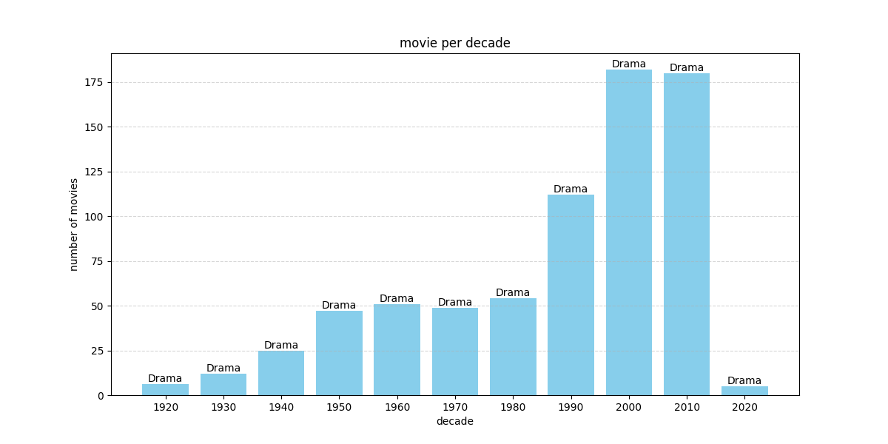
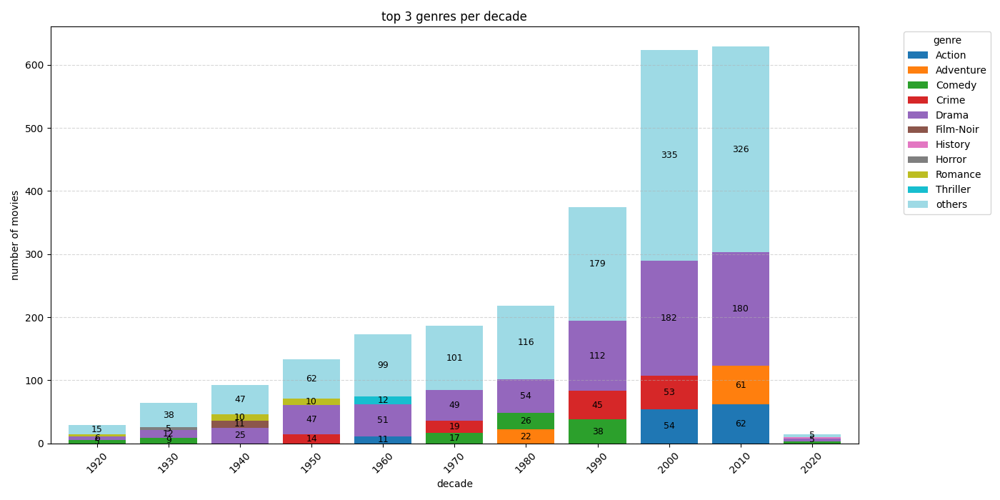

README

# 프로젝트 개요
이건 제 첫 포트폴리오 프로젝트입니다.

시대별로 인기를 끌었던 영화 장르들을 분석해보면 앞으로도 어떤 장르가 인기를 끌을지 예측하는데에 도움이 될 수 있겠다는 호기심으로 이 코드를 작성했습니다.

# 데이터 소스
캐글에서 imdb_top_1000.csv 데이터셋을 사용했습니다.

<https://www.kaggle.com/datasets/harshitshankhdhar/imdb-dataset-of-top-1000-movies-and-tv-shows>

원본 CSV 파일도 프로젝트 파일 안에 들어있습니다. 

# 사용한 라이브러리
파이썬 라이브러리로써, 판다스와 matplotlib을 사용했습니다.

# 분석 디테일
1. 기본 트렌드 분석 (basic_analysis.py)
이 코드는 연도를 10년으로 묶어놓은 다음, 각 시대별로 top1000 안에 들었던 영화들 중 가장 인기 많았던 장르가 무엇인지 막대 그래프로 시각화했습니다. 

2. 더 분석하기 (more_analysis.py)
위 그래프를 보고 난 후, 가장 인기 많았던 top3 장르도 같이 표시하면 더욱 보기 쉬울지도 모르겠다는 호기심이 들었습니다. 그 결과물이 이 more_analysis 코드입니다. 코드를 실행시키면 아래 사진처럼 어느 장르가 얼마나 비중을 차지하는지도 같이 볼 수 있습니다.

---

# 미래 목표
작지만 저에겐 꽤 큰 프로젝트였습니다. 앞으로도 계속 수준 높혀서 포트폴리오를 채워나가도록 하겠습니다.

---

# Project Overview
This is my very first portfolio project.

I developed this code based on the idea that analyzing shifts in popular movie genres over the decades could help us predict which genres will trend in the future.

# Data Source
I used the imdb_top_1000.csv dataset from Kaggle.

<https://www.kaggle.com/datasets/harshitshankhdhar/imdb-dataset-of-top-1000-movies-and-tv-shows>

The raw CSV file is also uploaded within this project folder for easy access.

# Used Library
I used the Python's Pandas and Matplotlib.

# Analysis Details
1. Basic Trend Analysis (basic_analysis.py)
This script focuses on identifying the most dominant genres per decade. It generates a bar chart that visualizes the distribution of movies that made it into the IMDB Top 1000 list over time.

2. Advanced Proportion Analysis (more_analysis.py)
Driven by curiosity to see a more detailed breakdown, I refined the code to visualize the top 3 genres as a stacked bar chart. This version allows you to see not just the #1 genre, but the relative proportions of the top three leading genres, making the trends much easier to interpret.

---

# Future Goals
This was a small but significant milestone for me. I am committed to leveling up my skills and will continue to build a more robust portfolio with increasingly advanced projects.

